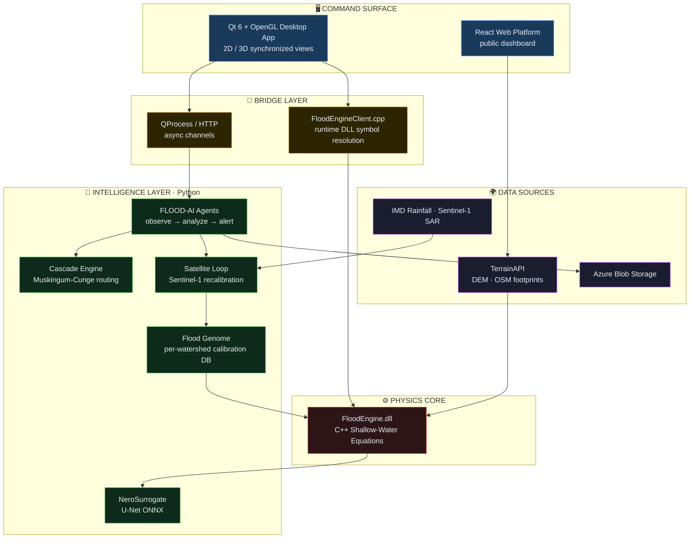

<!-- ════════════════════════════════════════════════════════════════ -->
<!--  NEROLITH · Flood Intelligence Platform · IIT Roorkee · 2025      -->
<!-- ════════════════════════════════════════════════════════════════ -->

<div align="center">

<!-- ░░░ REPLACE WITH YOUR LOGO ░░░ -->
<!-- Put your logo at: docs/assets/nerolith_logo.png  then the line below works -->


<br/>

<!-- Big wordmark — uses an SVG text banner. Replace with a banner image if you have one -->


<h3>India's first end-to-end Flood Intelligence Operating System</h3>

<p><em>Physics&nbsp;·&nbsp;Machine&nbsp;Learning&nbsp;·&nbsp;Autonomous&nbsp;Agents&nbsp;·&nbsp;Satellite&nbsp;Recalibration&nbsp;—&nbsp;one&nbsp;unified&nbsp;platform</em></p>

<br/>

<!-- ░░░ BADGES ░░░ -->


<br/>

<sub>
<a href="#-the-problem">Problem</a> ·
<a href="#-architecture">Architecture</a> ·
<a href="#-the-nine-layers">Layers</a> ·
<a href="#-the-physics">Physics</a> ·
<a href="#-results">Results</a> ·
<a href="#-vs-the-industry">Comparison</a> ·
<a href="#-running-the-platform">Run</a>
</sub>

</div>

---

## ◆ The Problem

Conventional flood tools — **HEC-RAS**, **MIKE FLOOD** — are single-run, engineer-operated calculators. An expert loads a DEM, configures parameters, runs one simulation, and reads one answer. Hours of setup for a single static map.

Real disasters are not static. Rainfall shifts, dams release, soil saturates, rivers block, and the situation evolves minute by minute across an entire basin.

> **Nerolith** reframes flood modeling as a *continuously learning, real-time operational intelligence system* — spanning the complete event lifecycle from **72-hour precognition**, through **active disaster response**, to **post-event structural assessment**.

---

## ◆ Architecture

A layered intelligence stack. A deterministic C++ physics core at the base, a Python intelligence layer above it, and a Qt/OpenGL command surface on top — bridged by a runtime DLL client and asynchronous process channels.



<div align="center">
<sub><strong>The engine binary hot-swaps without recompiling the frontend.</strong> Each layer versions independently.</sub>
</div>

---

## ◆ The Nine Layers

<table>
<thead>
<tr>
<th width="60">#</th>
<th width="200">Layer</th>
<th>Capability</th>
<th width="180">Stack</th>
</tr>
</thead>
<tbody>

<tr>
<td align="center"><strong>01</strong></td>
<td>🌊 <strong>FloodEngine</strong></td>
<td>Deterministic C++ physics core. Solves 2-D Shallow Water Equations with Green-Ampt infiltration, Manning roughness, D8 flow, Wang-Liu pit filling, and a Random Forest blend.</td>
<td><code>C++ · DLL</code></td>
</tr>

<tr>
<td align="center"><strong>02</strong></td>
<td>🤖 <strong>NeroSurrogate</strong></td>
<td>U-Net deep-learning surrogate trained on FloodEngine outputs. Approximates physics in milliseconds for real-time what-if scenario sweeps. Exports to ONNX for direct C++ inference.</td>
<td><code>PyTorch · ONNX</code></td>
</tr>

<tr>
<td align="center"><strong>03</strong></td>
<td>🐟 <strong>FLOOD-AI Agents</strong></td>
<td>Autonomous MiroFish agents — independent processes monitoring hydrological state, computing trends, and emitting alerts when thresholds break. Observe → analyze → report.</td>
<td><code>Python · FastAPI</code></td>
</tr>

<tr>
<td align="center"><strong>04</strong></td>
<td>⛓️ <strong>Cascade Engine</strong></td>
<td>Routes discharge between sub-catchments on a directed acyclic graph. Models compound basin failures — slope → blockage → dam breach → flood wave — via Muskingum-Cunge routing.</td>
<td><code>Python · NetworkX</code></td>
</tr>

<tr>
<td align="center"><strong>05</strong></td>
<td>🛰️ <strong>Satellite Loop</strong></td>
<td>Real-time Sentinel-1 SAR change detection. Computes divergence between predicted and observed flood extent, auto-recalibrates Manning's <em>n</em> in &lt; 5 minutes.</td>
<td><code>Python · GDAL</code></td>
</tr>

<tr>
<td align="center"><strong>06</strong></td>
<td>🧬 <strong>Flood Genome</strong></td>
<td>Per-watershed calibration database. Stores Green-Ampt and roughness parameters by soil and terrain class — accuracy compounds with every event processed.</td>
<td><code>Database</code></td>
</tr>

<tr>
<td align="center"><strong>07</strong></td>
<td>🗺️ <strong>TerrainAPI</strong></td>
<td>Geospatial reconstruction service — DEM fetch via OpenTopography, OSM building/road extrusion for arbitrary lat/lon. Serves Nerolith and external clients.</td>
<td><code>Python · API</code></td>
</tr>

<tr>
<td align="center"><strong>08</strong></td>
<td>🖥️ <strong>Flood3D Desktop</strong></td>
<td>Qt 6 + OpenGL command center. Synchronized 2D/3D views, satellite texturing, building extrusion, SWE animation timeline, surrogate batch analysis, cascade reporting.</td>
<td><code>Qt 6 · OpenGL</code></td>
</tr>

<tr>
<td align="center"><strong>09</strong></td>
<td>☁️ <strong>Azure Cloud</strong></td>
<td>Per-session blob storage. Archives DEM grids, flood depth rasters, risk maps, AI alerts, and impact reports for every simulation run.</td>
<td><code>Azure Blob</code></td>
</tr>

</tbody>
</table>

---

## ◆ The Physics

The FloodEngine core solves the **2-D Shallow Water Equations** on a structured raster grid derived from the input DEM.

**Continuity & momentum:**

$$
\frac{\partial h}{\partial t} + \frac{\partial (hu)}{\partial x} + \frac{\partial (hv)}{\partial y} = r - f
$$

$$
\frac{\partial u}{\partial t} = -g\,\frac{\partial (h + z)}{\partial x} - \frac{n^2\, g\, u \sqrt{u^2 + v^2}}{h^{4/3}}
$$

where $h$ = water depth, $u,v$ = depth-averaged velocities, $z$ = bed elevation, $r$ = rainfall rate, $f$ = infiltration, $n$ = Manning's roughness, $g$ = gravity.

<details>
<summary><strong>Green-Ampt infiltration</strong> — soil absorption model</summary>

<br/>

$$
f(t) = K_s \left( 1 + \frac{\psi \cdot \Delta\theta}{F(t)} \right)
$$

$K_s$ = saturated hydraulic conductivity, $\psi$ = wetting-front suction head, $\Delta\theta$ = moisture deficit, $F(t)$ = cumulative infiltration. Parameters calibrated per watershed and stored in the **Flood Genome** database.

</details>

<details>
<summary><strong>CFL stability condition</strong> — adaptive time-stepping</summary>

<br/>

$$
\Delta t \leq \frac{\Delta x}{\sqrt{g\, h_{\max}} + |u_{\max}|}
$$

Wetting–drying follows a thin-film approach: cells with $h < \epsilon = 10^{-4}\,\text{m}$ are treated as dry and excluded from momentum computation, preventing spurious velocities at flood fronts.

</details>

<details>
<summary><strong>Physics–ML blend</strong> — the surrogate handoff</summary>

<br/>

$$
h_{\text{blend}}(x,y) = \alpha \cdot h_{\text{physics}} + (1 - \alpha)\cdot \hat{h}_{\text{RF}}
$$

Blend weight $\alpha \in [0,1]$ is user-controllable. At $\alpha=1$ the system runs pure physics; at $\alpha=0$ it runs rapid-assessment ML mode for sub-minute scenario screening.

</details>

<details>
<summary><strong>Muskingum-Cunge routing</strong> — cascade discharge propagation</summary>

<br/>

$$
Q_2 = C_0 Q_1' + C_1 Q_1 + C_2 Q_2'
$$

Routing coefficients $C_0, C_1, C_2$ are derived from reach geometry and wave celerity, propagating dam-release hydrographs downstream across the basin DAG.

</details>

<details>
<summary><strong>Satellite divergence & recalibration</strong> — the learning loop</summary>

<br/>

Divergence between observed and simulated flood extent:

$$
D(x,y) = F_{\text{obs}}(x,y) - F_{\text{sim}}(x,y)
$$

When $D_{\max} > 15\%$, recalibration fires. Manning's $n$ adjusts by divergence direction:

$$
n_{\text{new}} = \begin{cases} n - \delta n & \text{if under-prediction dominant} \\ n + \delta n & \text{if over-prediction dominant} \end{cases}
$$

The engine reruns from the current timestep — updated flood maps reach field officers in under 5 minutes.

</details>

---

## ◆ Results

<div align="center">

### NeroSurrogate · Physics vs ML Performance

<!-- ░░░ REPLACE WITH YOUR GRAPH ░░░  docs/assets/speed_comparison.png -->


</div>

<table align="center">
<tr>
<td align="center" width="170">
<h2>1.8×</h2>
<sub>batch scenario speedup<br/>vs full physics</sub>
</td>
<td align="center" width="170">
<h2>0.83</h2>
<sub>validation IoU<br/>held-out test set</sub>
</td>
<td align="center" width="170">
<h2>~15s</h2>
<sub>100 rainfall scenarios<br/>vs 1.2 hrs physics</sub>
</td>
<td align="center" width="170">
<h2>&lt;5min</h2>
<sub>satellite recalibration<br/>update cycle</sub>
</td>
</tr>
</table>

> **What-if at scale.** Where physics simulation takes ~45s per scenario, NeroSurrogate sweeps 100 rainfall scenarios (10–150 mm/hr) in seconds — identifying the exact rainfall threshold where a region crosses into CRITICAL risk, then generating a full PDF intelligence report.

---

## ◆ vs The Industry

<table>
<thead>
<tr>
<th>Capability</th>
<th align="center" width="130">Nerolith</th>
<th align="center" width="130">HEC-RAS</th>
<th align="center" width="130">MIKE FLOOD</th>
</tr>
</thead>
<tbody>
<tr><td>Real-time satellite recalibration</td><td align="center">✅</td><td align="center">❌</td><td align="center">❌</td></tr>
<tr><td>Autonomous monitoring agents</td><td align="center">✅</td><td align="center">❌</td><td align="center">❌</td></tr>
<tr><td>ML surrogate layer</td><td align="center">✅</td><td align="center">❌</td><td align="center">❌</td></tr>
<tr><td>72–96 hr early warning</td><td align="center">✅</td><td align="center">❌</td><td align="center">❌</td></tr>
<tr><td>Structural failure prediction</td><td align="center">✅</td><td align="center">❌</td><td align="center">❌</td></tr>
<tr><td>Watershed calibration genome</td><td align="center">✅</td><td align="center">❌</td><td align="center">❌</td></tr>
<tr><td>Inverse infrastructure design</td><td align="center">✅</td><td align="center">❌</td><td align="center">❌</td></tr>
<tr><td>Basin-scale compound flooding</td><td align="center">✅</td><td align="center">⚠️ Limited</td><td align="center">⚠️ Limited</td></tr>
<tr><td>Field mobile integration</td><td align="center">✅</td><td align="center">❌</td><td align="center">❌</td></tr>
<tr><td>Open data pipeline</td><td align="center">✅</td><td align="center">⚠️ Manual</td><td align="center">⚠️ Manual</td></tr>
</tbody>
</table>

---

## ◆ Case Study · Kerala 2018

The August 2018 Kerala floods — the most severe in nearly a century, with 35 of 44 dams opened simultaneously, 2,346.6 mm rainfall (42% above average), and 5.4 million people displaced.

Selected as Nerolith's primary validation case for its complete observational record:

| Parameter | Value |
|---|---|
| **DEM Source** | SRTM 30 m (NASA) |
| **Domain** | Chalakudy River Basin, Kerala |
| **Grid Resolution** | 30 m × 30 m |
| **Rainfall Input** | IMD gridded, 3-hourly |
| **Simulation Period** | 14–19 August 2018 |
| **Ground Truth** | Sentinel-1 SAR, 15 August 2018 |
| **Pre-recalibration divergence** | 18.4% |

<sub>📋 Full quantitative validation against Sentinel-1 SAR ground truth in progress. Metrics published upon calibration completion.</sub>

---

## ◆ Repository Structure

```
Nerolith-Platform/
│
├── FloodEngine/        ⚙️  C++ physics core — SWE, Green-Ampt, D8, RF blend
├── NeroSurrogate/      🤖  U-Net ML surrogate — training, ONNX export, inference
├── FLOOD-AI/           🐟  Agents + Cascade + Genome — FastAPI intelligence layer
├── Flood3D/            🖥️  Qt 6 + OpenGL desktop command center
├── TerrainApi/         🗺️  DEM + OSM geospatial reconstruction service
└── WebApp/             🌐  React frontend + backend — public dashboard
    ├── frontend/
    └── backend/
```

---

## ◆ Running the Platform

> **Prerequisites:** Qt 6.11+ (MSVC), Python 3.11+, Node 18+, a built `FloodEngine.dll`

<details>
<summary><strong>1 · FloodEngine</strong> (C++ physics core)</summary>

<br/>

```bash
cd FloodEngine
# Build the DLL with your MSVC / CMake toolchain
# Output: FloodEngine.dll → place beside the Qt executable
```

</details>

<details>
<summary><strong>2 · NeroSurrogate</strong> (ML surrogate)</summary>

<br/>

```bash
cd NeroSurrogate
pip install -r requirements.txt

python main.py generate --n 1000      # generate training data from DLL
python main.py train                  # train the U-Net
python main.py export                 # export to ONNX + C++ header
python main.py infer --dem <path>     # run inference
```

</details>

<details>
<summary><strong>3 · FLOOD-AI</strong> (agents + cascade + surrogate API)</summary>

<br/>

```bash
cd FLOOD-AI
pip install -r requirements.txt
python main.py                        # starts FastAPI on :8000
# /surrogate/batch · /cascade/analyze · /ingest/tick · /agents/{id}
```

</details>

<details>
<summary><strong>4 · Flood3D</strong> (Qt desktop)</summary>

<br/>

```bash
cd Flood3D
# Open Flood3D.pro / CMakeLists.txt in Qt Creator
# Configure with MSVC 2022 64-bit kit → Build → Run
# Requires FloodEngine.dll beside the executable
```

</details>

<details>
<summary><strong>5 · WebApp</strong> (React dashboard)</summary>

<br/>

```bash
cd WebApp/frontend
npm install && npm run dev

cd ../backend
npm install && npm start
```

</details>

---

<div align="center">

<br/>

<!-- ░░░ OPTIONAL: small logo again ░░░ -->


<h3>NEROLITH</h3>


<br/><br/>


</div>
